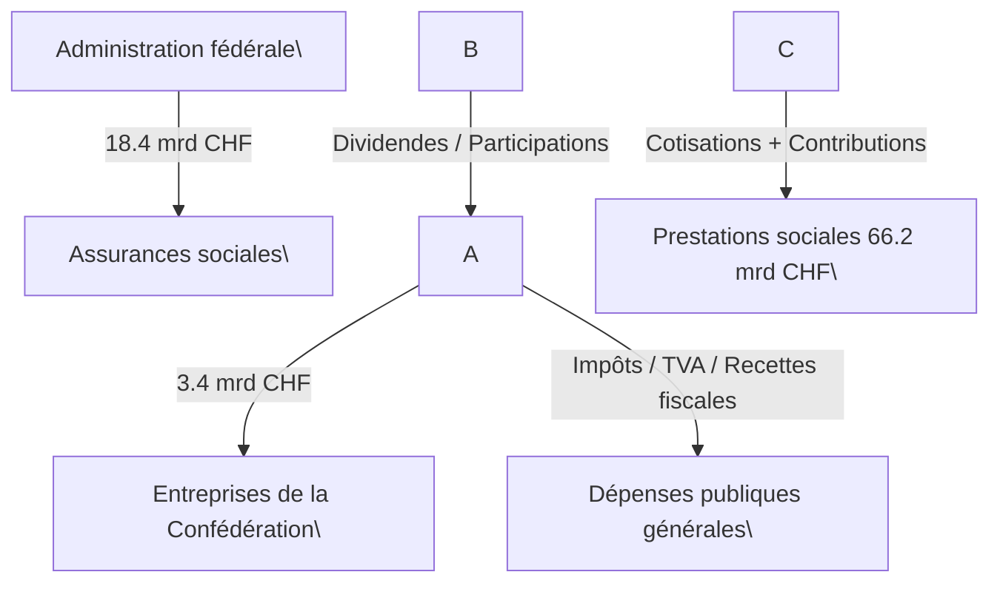

# 📘 Manuel d'utilisation – DeVAT / User Manual (FR/EN)

---

## 🇫🇷 Initialisation / 🇬🇧 Initialization

```bash
python3 -m venv ~/DeGov/.venv && source ~/DeGov/.venv/bin/activate && pip install requests pandas openpyxl beautifulsoup4
```

---

## ▶️ 🇫🇷 Import TVA automatique / 🇬🇧 Automated TVA Import

```bash
python ~/DeGov/devat_import_all.py
```

---

## 🔐 SHA256 / Signature

```bash
python ~/DeGov/sign_sha256.py
```

---

## 🚀 Publication Git automatique

```bash
python ~/DeGov/auto_git_push.py
```

---

## 🧩 Génération complète (tout-en-un)

```bash
python ~/DeGov/devat_publish_all.py
```

---

## 🧭 Menu interactif terminal

```bash
python ~/DeGov/devat_menu.py
```

---

## 🕒 Cron automatique mensuel (chaque 7 à 8h)

```bash
(crontab -l 2>/dev/null; echo "0 8 7 * * cd ~/DeGov && ~/DeGov/.venv/bin/python devat_publish_all.py") | crontab -
```

Vérifier :
```bash
crontab -l
```

---

## 🖱 Icône bureau macOS

```bash
echo '#!/bin/zsh
cd ~/DeGov
source ~/DeGov/.venv/bin/activate
python devat_publish_all.py' > ~/Desktop/lancer_devat.command && chmod +x ~/Desktop/lancer_devat.command
```

---

## 🧾 Génération ZIP TVA mensuels

```bash
python ~/DeGov/zip_monthly_archives.py
```

---

## 🌍 Générer l’index public SHA256 (DApp)

```bash
python ~/DeGov/publish_sha256_in_dapp.py
```

---

## ⛓ Préparer un manifeste IPFS

```bash
python ~/DeGov/prepare_ipfs_manifest.py
```

---

## 🔗 Interface publique GitHub Pages

[https://7red.github.io/DeGov/](https://7red.github.io/DeGov/)

---

## 🧪 Test manuel complet

```bash
cd ~/DeGov && ~/DeGov/.venv/bin/python devat_publish_all.py
```




